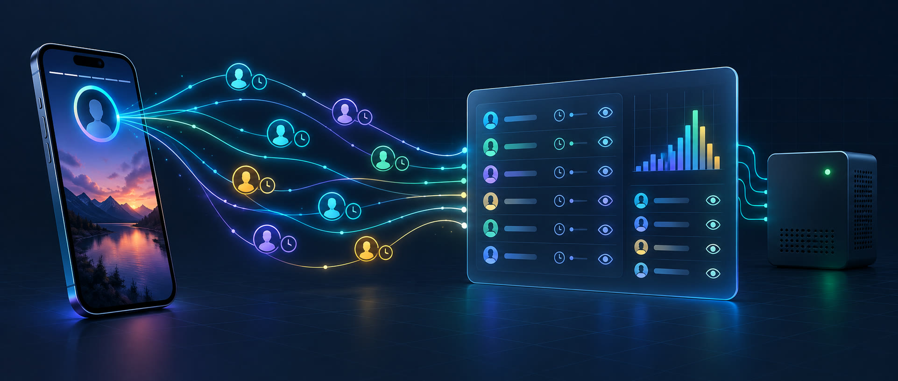
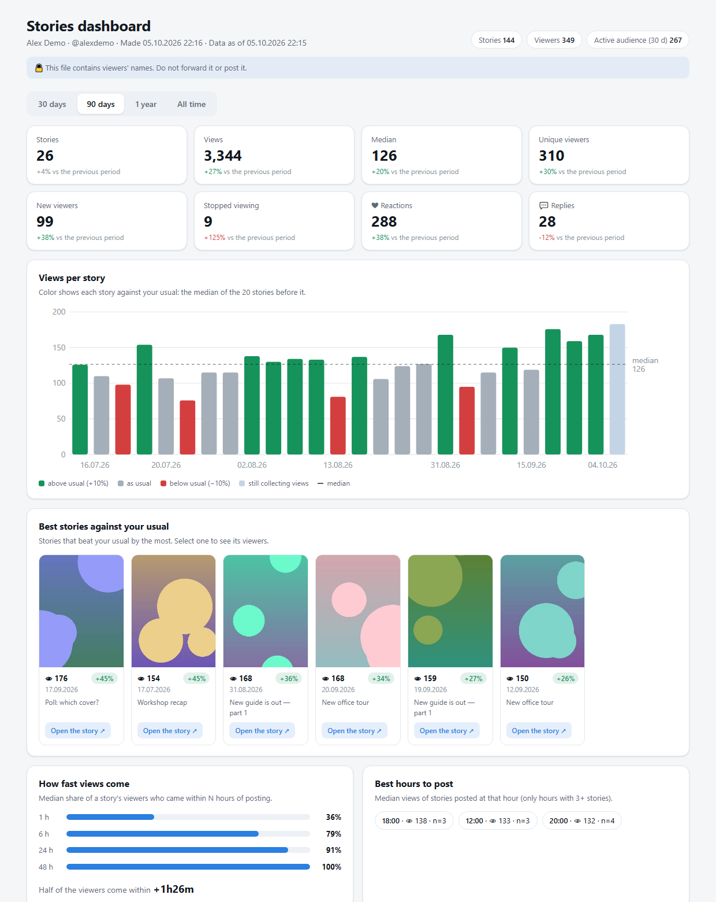
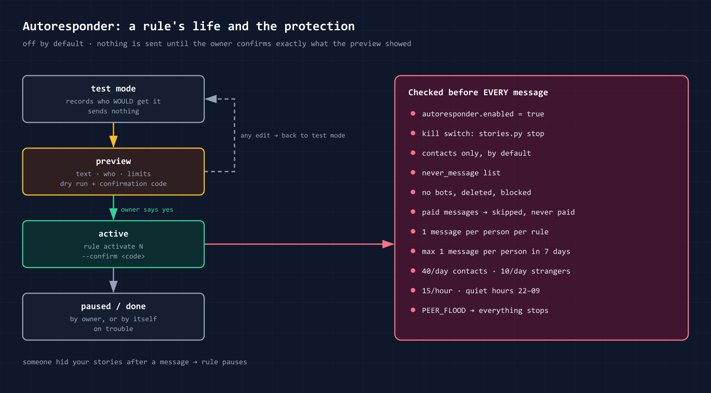
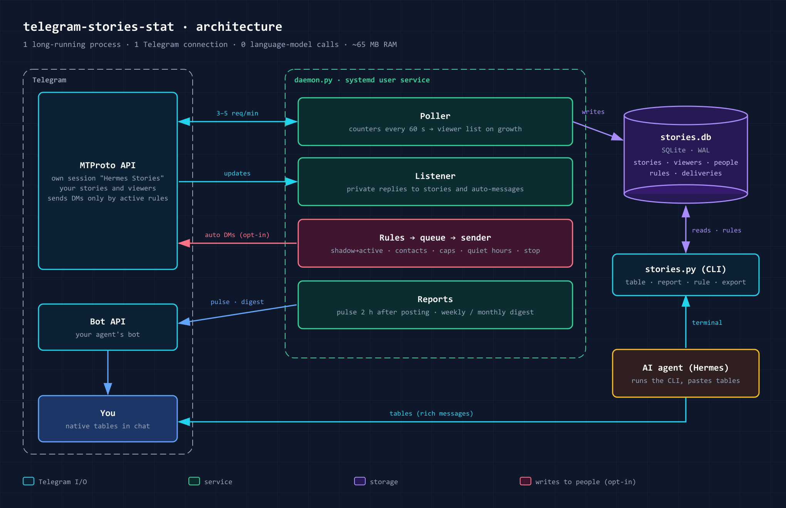
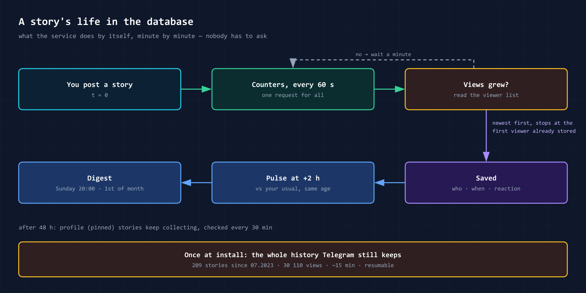

# telegram-stories-stat

**English** · [Русский](README.ru.md) · [Changelog](CHANGELOG.md)



This skill shows who viewed your Telegram stories and when. It makes statistics tables. It can also send
messages to viewers by your rules.

The skill is for personal AI agents. It works with [Hermes Agent](https://github.com/NousResearch/hermes-agent)
and with all agents that can run terminal commands. The skill service does not use a language model: it
collects data and calculates statistics. The agent shows you the tables.

## Functions

### 1. Viewer list

The service checks your stories each minute while a rule is active, and each hour when no rule is active (see
[How the service works](#how-the-service-works)). After a story expires, the service reads its viewer list one
last time, so the views of the last minutes are not lost. For each viewer, it records the name, the username,
the time of the view and the reaction. At installation, the service loads the history of your past stories that
Telegram keeps.

The database keeps the first name, the last name, all usernames and the Telegram ID of each viewer. When a
viewer changes the name or the username, the database keeps the old values. In tables, the username is a link
to the profile. If a viewer has no username, the table shows only the name.

### 2. Statistics of one story

For one story, you get:

- the views, reactions, replies and reposts;
- the number of viewers 1, 6, 24 and 48 hours after you posted the story;
- a comparison with your usual stories;
- the list of all viewers in the order of their views.

Ask the agent: *"Who viewed my last story?"*

Example of a reply (the data is not real):

```
Story 221 · 05.10.2026 14:01 · 📷 photo
👁 133 · ❤ 7 · 💬 2 · ↪ 0 · vs usual +12%
1h: 41 · 6h: 88 · 24h: 121 · 48h: 133 · new viewers: 3
👥 101 · 📇 4 · · 28 · ⭐ 6
data as of 07.10 14:05 · 128 of 133 in the list · final read after expiry 07.10 14:20
```

The last line tells how complete the numbers are. The list can be shorter than the counter: Telegram does not
list viewers in incognito mode and deleted accounts.

| # | Time | After | Name | Username | Reaction | Who |
|---:|---|---:|---|---|:---:|:---:|
| 1 | 14:03 | +2m | Kate Smith | [@kate](https://t.me/kate) | ❤ | ⭐👥 |
| 2 | 14:10 | +9m | Alex | — | | 📇 |
| 3 | 15:22 | +1h21m | Max Lee | [@maxlee](https://t.me/maxlee) | 🔥 | · |

Symbols: 👁 views, ❤ reactions, 💬 replies, ↪ reposts. The "Who" column: 👥 mutual contact, 📇 contact,
· not a contact, ⭐ close friend. In Telegram, the reply comes as a real table.

### 3. Summary for a period

One table shows all stories for a period: a week, a month or your dates. For each story, the table shows the
views, the reactions and a comparison with your usual result. Below the table, you see the unique viewers, the
new viewers and the viewers who stopped watching.

- **New viewers** are people seen for the first time in the collected history. The table tells the date when
  this history starts. A "new" viewer could have watched earlier stories that are not in the history.
- **Stopped watching** is shown only when the period has at least two stories with viewer lists. If you did not
  post, the table shows "—": nobody could stop watching.

Ask the agent: *"Summary of my stories for September"*

### 4. Audience groups

The skill gives each viewer a status. The status is calculated from your last 20 stories.

| Status | Meaning |
|---|---|
| core | views 70% of your stories or more, usually in the first 3 hours |
| regular | views 40% of your stories or more |
| occasional | views less than 40% of your stories |
| new | the first view was in the last 14 days |
| cooling | no views for 21 days and 2 or more of your stories missed; viewed 40% of your stories or more before |
| lost | no views for 60 days and 3 or more of your stories missed |

A pause in your posting does not make anybody "cooling" or "lost": these statuses need stories that the person
did not view.

Ask the agent: *"Who is my core audience?"* or *"Who stopped watching my stories?"*

### 5. Best time to post

The table shows the views by hour and by day of the week. It also shows the posting hours that get the most
viewers. To compare the stories fairly, the skill counts the viewers of each story in its first 24 hours. The table
shows the median, the range and the number of stories for each hour. With few stories, take the result as an
idea to test, not as a rule.

Ask the agent: *"When is the best time to post a story?"*

### 6. Automatic reports

The service sends reports to your chat with the agent:

- a pulse 2 hours after you post a story, for example "📈 +30% above usual";
- a weekly summary, by default on Sunday at 20:00;
- a monthly summary.

### 7. Autoresponder

The autoresponder sends a private message to a viewer or a notification to you. A rule sets which stories,
which viewers and which message. By default, the autoresponder is off. For details, see
[Autoresponder](#autoresponder).

### 8. Channel stories

For your channels, the skill shows the views, reactions and reposts of each story. Telegram does not show the
viewers of channel stories.

Ask the agent: *"Statistics of the stories in @mychannel"*

### 9. Export to Excel

The skill saves stories, viewers and views to CSV files. Excel and Google Sheets open these files.

Ask the agent: *"Export the views for 90 days to CSV"*

### 10. Dashboard

The skill makes one HTML file with all the statistics on one page. Open it in a browser on a computer or a
phone. You do not need a server or an internet connection.

The page shows:

- the main numbers for 30 days, 90 days, 1 year or all time, and the change against the previous period;
- the views of each story; the color compares each story with your usual result;
- your best stories, with previews;
- how fast a story collects its viewers;
- the best hours to post, and a map of views by day of the week and hour;
- the trend by month: viewers, new viewers, the median views of one story;
- the audience groups and a table of all viewers, with a search;
- the channel stories and the autoresponder rules.

Select a story to see its viewers. Select a person to see the stories that this person viewed. The button
**Open the story** opens the story in Telegram while the story is available.



Ask the agent: *"Make the stories dashboard"*. The agent sends you the file.

> **Note:** the file contains the names of your viewers. Do not forward it and do not publish it.

To share the statistics, make an **anonymized copy**: `stories.py dashboard --anonymized` (the file
`dashboard-anon.html`). The copy has all the numbers, the charts and the audience groups. It has no viewer
names, usernames or Telegram IDs — not on the page and not in the data inside the file. The table of people,
the viewer lists and the autoresponder rules are not in the copy. Your captions and story previews are in it.

## Installation

Requirements:

- a computer or a server with Linux and Python 3.10 or later;
- Telegram API keys `api_id` and `api_hash`. Get them at <https://my.telegram.org> → API development tools;
- Hermes Agent or another agent that can run terminal commands.

Procedure:

1. Install the skill:
   ```bash
   hermes skills install itpartypattaya/telegram-stories-stat/skills/telegram-stories
   ```
2. Run the installer in a terminal:
   ```bash
   python3 ~/.hermes/skills/telegram-stories/scripts/install.py
   ```
3. Type `api_id` and `api_hash` when the installer asks for them. If `TG_API_ID` and `TG_API_HASH` are
   already in `~/.hermes/.env`, the installer does not ask.
4. Scan the QR code in the terminal. On your phone, open Telegram → Settings → Devices → Link Desktop Device.
5. If you have a cloud password, type it. The screen does not show the characters.
6. Press Enter to load your past stories.

The installer installs the Telethon and qrcode libraries, creates the database and the config file, and starts
the service.

To check the installation, run `install.py --check`.

To get real tables from Hermes, set `platforms.telegram.extra.rich_messages: true` in `config.yaml`. Without
this setting, a table comes as a list.

Note: to log in with a phone number and a code, run `stories.py login --with-code`.

Other ways to install:

- **Hermes plugin.** Run `hermes plugins install itpartypattaya/telegram-stories-stat`. The scripts are in
  `~/.hermes/plugins/telegram-stories-stat/skills/telegram-stories/scripts/`.
- **Another agent.** Clone the repository, run the same scripts and give the file `SKILL.md` to the agent.

The service runs from the folder where you ran `install.py`.

## Autoresponder



### Parts of a rule

A rule has four parts:

| Part | Options |
|---|---|
| **Stories** | specific stories · the next story · stories with a marker in the caption (for example, `#guide`) · all stories |
| **Viewers** | all · specific people (@username) · a segment · the members of a group · viewers with a reaction · new viewers · an audience group (for example, core) |
| **Event** | a view · a reaction · a reply to the story |
| **Action** | a private message to the viewer · a notification to you · add the viewer to a segment |

A rule also sets who can get messages:

- only your contacts (default);
- people who wrote to you before;
- all people, including strangers.

You do not write rules yourself. Tell the agent what you need. The agent makes the rule and shows it to you.

### Example 1. A lead magnet for the viewers of the last story in a series

**Task.** You post a series of stories. Viewers who open the last story get a link to your guide.

**Procedure:**

1. Put a marker in the caption of the last story only, for example `#guide`. Do not use this marker in the
   other captions.
2. Tell the agent: *"Make a rule: send everyone who views the story with the marker #guide this message:
   '{first_name}, thank you for watching! Your guide: https://example.com/guide'"*. The service replaces
   `{first_name}` with the first name of the viewer.
3. Read the preview of the rule. If it is correct, answer "yes".
4. Post the series.

**Result.** A viewer opens the last story. After some minutes, the viewer gets your message. The default delay
is 2 to 6 minutes. Each viewer gets the message one time.

**Notes:**

- Turn on the rule before you post the series. Viewers who opened the story before that do not get the
  message.
- Telegram counts a view when a viewer opens a story. A fast tap through the series also counts as a view.
- The message is text only. Put the link to the guide in the text. You cannot attach a file or a button.
- If you pin the last story to your profile, the rule continues to work for 30 days.
- A viewer who is not your contact gets the message only if the rule permits messages to all people. The limit
  for such messages is 10 per day for the account.

**Caution:** Telegram can restrict your account if recipients mark its messages as spam.

**Option for many viewers who are strangers.** In the last story, write: "Reply to this story and I will send
you the guide". Tell the agent to make the rule for a reply, not for a view. The viewer writes to you first, so
the limit is higher: 40 messages per day. Any reply starts the rule. The service does not read the text of the
reply.

### Example 2. A confirmation that a person saw your announcement

**Task.** You post a story for specific people, for example giveaway winners or clients with a ready order.
You want to know when each person opens the story. Each person gets a confirmation in a private message.

**Procedure:**

1. Tell the agent: *"When @anna_k and @maxlee view my next story, send me a notification. Send each of them:
   'You saw the announcement. Your prize is registered. I will contact you today.' Delay: one minute."*
2. The agent makes two rules: a notification to you and a message to the person. Read the preview and answer
   "yes".
3. Post the story.

**Result:**

- You get a notification: "👀 Anna @anna_k · Story 245, 14:03 · rule «Winners»". The time in the
  notification is the time of the view.
- The person gets your message.
- The database keeps the time of the view. Ask the agent at any time: *"Which winners saw the announcement?"*

**Notes:**

- The service finds a view in 1 minute. The service finds a new story in 5 minutes. Then the delay of the rule
  starts. With a delay of one minute, messages arrive 1–2 minutes after the view.
- From 22:00 to 09:00, messages and notifications wait until the morning. You can change these hours in the
  config.
- The person does not have to be in the database. The rule starts at the first view of that person.
- The notification to you works when the autoresponder is off.
- The service does not send the message if you wrote to the person in the last 24 hours. The service also does
  not send the message if the person got an automatic message in the last 7 days.
- If the person is not your contact, the rule must permit messages to all people.
- Telegram does not show viewers in incognito mode. For these viewers, there is no notification and no message.

### Other examples

- **Thank you for a reaction.** Contacts who reacted with ❤ get a short "thank you".
- **New viewers.** You get a notification about each new viewer. You decide if you write to the viewer.
- **Warm-up.** The first rule adds the viewers of a teaser story to the segment "warm". After the main story,
  the second rule writes only to this segment.
- **Two text variants.** The service divides the recipients equally between two texts.
- **Only the members of a group.** Make a group segment: `stories.py segment create vibe --kind chat --source
  @group` (or the group link, or its numeric ID). The rule writes only to the members of the group. The service
  reads the member list again each 15 minutes. Right before each message, the service asks Telegram if this
  person is in the group now. If the person left the group, or Telegram gives no clear answer, the message does
  not go.

### Turn on a rule

1. Turn on the autoresponder: set `autoresponder.enabled: true` in `~/.hermes/telegram-stories.json`. You can
   also tell the agent to do this. When the autoresponder is off, the service sends no private messages.
   Notifications to you continue.
2. Tell the agent the rule that you need. A new rule starts in test mode. In test mode, the service records who
   would get the message and sends nothing.
3. Read the preview: the text, the recipients, the number of messages and the limits.
4. Answer "yes". The rule starts to work exactly as the preview shows. After each change, the rule goes back
   to test mode.
5. To see the result, tell the agent: *"Show rule 3"*. You see who got the message, who did not get it and
   why. Replies are counted in two ways: **replied to it** means that the person replied to that message;
   **wrote after it** means that the person wrote to you in the next 7 days, maybe about something else.

To stop all messages, tell the agent "stop" or run `stories.py stop`. To continue, run `stories.py start`.
From your phone: Telegram → Settings → Devices → "Hermes Stories" → Terminate Session.

### Account protection

Rules cannot turn off this protection. You can change the numbers in the config.

- By default, only your contacts get messages. To write to other people, permit it in the rule.
- The service does not write to bots, deleted accounts and people who hid your stories or blocked you.
- The service does not write to people with paid messages (Stars). The service never pays.
- The service does not write to people in the `never_message` list.
- For a group segment, the service checks the membership in the group right before each message.
- One person gets one message for each rule. One person gets not more than one automatic message in 7 days.
- Limits per day: 40 messages to contacts, 40 to people who wrote to you, 10 to all other people. Limit per
  hour: 15 messages.
- Quiet hours: from 22:00 to 09:00. Before each message, there is a random delay of 2–6 minutes.
- If Telegram reports spam (`PEER_FLOOD`), the service stops all messages and sends you a notification.
- If a person hides your stories or blocks you after an automatic message, the service stops the rule.

Rule format and ready recipes: [`references/rules.md`](skills/telegram-stories/references/rules.md).

## How the service works



The skill has two parts:

- **The service** (`daemon.py`) runs in the background. It connects to Telegram through a separate session and
  writes data to a SQLite database on your computer.
- **The commands** (`stories.py`) read the database and print tables. The agent runs these commands when you
  ask a question.

Notifications and reports come from the bot of your agent.



Telegram does not report new views. For this reason, the service checks the stories itself:

| How often | What the service checks |
|---|---|
| each minute | the view counters of active stories |
| when a counter increases | the new viewers in the list |
| each 5 minutes | new stories |
| each 30 minutes | stories pinned to the profile (for the first 30 days) |
| after a story expires | the full viewer list one last time (within 7 days; without Premium, within 20 hours) |

These numbers apply while at least one rule is active. **With no active rule, the service checks each hour.**
When you activate a rule, the service goes back to the minute pace in less than a minute. At the hourly pace,
nothing is lost:

- The pulse and the summaries read their stories again right before they go.
- Tables and the dashboard read Telegram first if the data is older than 5 minutes (`--no-sync` skips this).
  A table of an older story reads this story, and a channel table reads this channel.
- Replies to stories arrive as messages, and the service records them at once.

To keep the minute pace always, set `poll.idle_s: 0` in the config.

The history import reads the story archive. Example: 209 stories and 30,110 views loaded in approximately
14 minutes.

### Resources

| | |
|---|---|
| Permanent processes | **1** (`telegram-stories.service`, a systemd user service) |
| Memory | **~65–70 MB** (measured: 67.8 MB; Python 3.11 + Telethon 1.44) |
| CPU | approximately 0.5 s to start, then approximately 0.1% of one core |
| Network | one connection to Telegram, a few KB per minute |
| Disk | ~5 MB of database per 30,000 views; previews ~20 KB per story (optional) |
| Language model | not used |
| Short-term | a command for ~1 second when the agent asks for a table; ~10 seconds for the dashboard; the history import one time |
| Not necessary | a web server, open ports, third-party services, telemetry |

## Separate Telegram session

The service logs in to your account as a separate device, "Hermes Stories". Reasons:

1. You can stop the service from your phone: Telegram → Settings → Devices → "Hermes Stories" → Terminate
   Session. Your other devices continue to work.
2. The service does not share a session with other programs. A shared session can stop working when two
   programs use it from different IP addresses.
3. Telegram shows when the session was active.
4. You can replace the session key. The other sessions do not change.

**Note.** Each Telegram session has full access to the account. Telegram has no read-only sessions. For this
reason:

- the session key is only in the file `~/.hermes/.env`, and only your user can read this file;
- type the login data only in the terminal. Do not type a password in the chat with the agent: the chat
  history keeps it, and the model provider receives it.

**Note.** Telegram spam limits apply to the full account, not to one session. The autoresponder limits protect
the account.

## Telegram limits

- Telegram does not show the viewers of channel stories. Only the views, reactions and reposts are available.
- Without Telegram Premium, the viewer list is deleted 24 hours after the story leaves the feed. The service
  saves the list before that time.
- Viewers in incognito mode are not in the list.

For details, see [`references/telegram-limits.md`](skills/telegram-stories/references/telegram-limits.md).

## Where the data is

| Path | Content |
|---|---|
| `~/.hermes/telegram-stories.json` | the config (no secrets) |
| `~/.hermes/.env` | the session key `STORIES_SESSION_STRING` and the API keys; only your user can read it |
| `~/.hermes/data/telegram-stories/stories.db` | the database: stories, viewers, view times, reactions, rules, sent messages |
| `~/.hermes/data/telegram-stories/thumbs/` | small story previews (`backfill --no-thumbs` skips them) |
| `~/.hermes/data/telegram-stories/exports/` | CSV files |
| `~/.hermes/data/telegram-stories/dashboard/dashboard.html` | the dashboard (`stories.py dashboard` makes it again) |
| `~/.hermes/data/telegram-stories/dashboard/dashboard-anon.html` | the anonymized copy (`stories.py dashboard --anonymized`) |

How to see the data:

- **Ask the agent.** The agent runs the correct table.
- **Open the data in Excel or Google Sheets.** The command `stories.py export views|people|stories
  [--period 90d]` saves a CSV file in the folder `exports/`. If your spreadsheet uses a decimal comma, set
  `tables.csv_delimiter: ";"` in the config.
- **Open the database.** Use a SQLite program, for example DB Browser for SQLite or Datasette. Open the
  database read-only. The main tables: `stories` (with `link`, the direct link to each story), `views`, `people` (viewers), `people_history` (changes of
  names and usernames), `story_replies` (replies), `rules`, `deliveries` (sent messages).

This is personal data of your viewers. It stays only on your computer. The service sends data only to Telegram
and to your chat with the agent. The service does not keep the text of replies to stories, only the fact of a
reply.

To change the paths, use the variables `HERMES_HOME`, `STORIES_HOME` and `STORIES_CONFIG`.

## Config

The installer makes the file `~/.hermes/telegram-stories.json` from
[`examples/config.example.json`](skills/telegram-stories/examples/config.example.json). The main settings:

| Setting | What it sets |
|---|---|
| `timezone` | the time zone of the tables |
| `locale` | the language of the table headers: `en` or `ru` |
| `channels` | your channels with stories to count |
| `notify` | where notifications go: `auto` (the agent's bot), `saved` (Saved Messages), `none` |
| `digest` | the day and the time of the weekly summary |
| `autoresponder` | on/off, limits, quiet hours, delay, the `never_message` list |

The service applies changes in the `autoresponder` section without a restart.

## Commands

The agent runs these commands. You can also run them in a terminal.

| Command | What it does |
|---|---|
| `stories.py table story last` | one story and its viewers (`last`, a story ID or `-2` for the story before the last) |
| `stories.py table summary --period 30d` | a summary for a period (or `--from … --to …`) |
| `stories.py table people [--status core]` | audience groups |
| `stories.py table hours --period 90d` | views by hour and by day of the week |
| `stories.py table compare 219 220 221` | a comparison of stories |
| `stories.py table channel --peer @channel` | channel stories |
| `stories.py export views --period 90d` | an export to CSV |
| `stories.py dashboard [--period 1y]` | the HTML dashboard: one file; `--no-thumbs` makes it smaller; `--anonymized` leaves out all viewer data |
| `stories.py rule …` | autoresponder rules |
| `stories.py segment create vibe --kind chat --source @group` | a segment of the members of a group (`segment refresh` reads it again now) |
| `stories.py stop` / `start` | stop / continue all automatic messages |
| `stories.py doctor` | a health check |

## Uninstall

1. Run `install.py --uninstall`. This command stops and removes the service. To also delete the collected data,
   add `--purge`.
2. Terminate the session "Hermes Stories": Telegram → Settings → Devices.
3. Remove the line `STORIES_SESSION_STRING` from the file `.env`.

## Security

An agent with terminal access can do the same actions as the service. The rule protection prevents errors. It
also prevents instructions from text that the agent read: a rule starts to work only after you saw its preview.

This protection does not stop a malicious agent. In that case, these items protect the account:

- the limits;
- messages to contacts only, by default;
- the `stop` command;
- the separate session that you can terminate from your phone.

## Disclosure

- **Network:** Telegram MTProto (the service session); Telegram Bot API `api.telegram.org` for notifications
  when a bot token is set. No other connections.
- **Files:** the paths in the table above; a systemd user unit `~/.config/systemd/user/telegram-stories.service`;
  the file `.env` (one or three keys).
- **Processes:** one permanent service; commands on request. `install.py` runs
  `pip install --upgrade "telethon>=1.40,<2" "qrcode>=7,<9"` only when these packages are missing (`--no-deps`
  skips this step).
- **Capabilities:** reads your stories, their viewers, reactions and replies. Sends private messages only by
  active rules and within the limits. Does not post, does not join chats, does not pay.
- **Language model:** none.
- **Automatic updates:** none.

## Tests

`python -m unittest discover -s tests` — the tests use data that is not real. They do not need the network or
Telethon.

## License

MIT © Anton Vaskov
