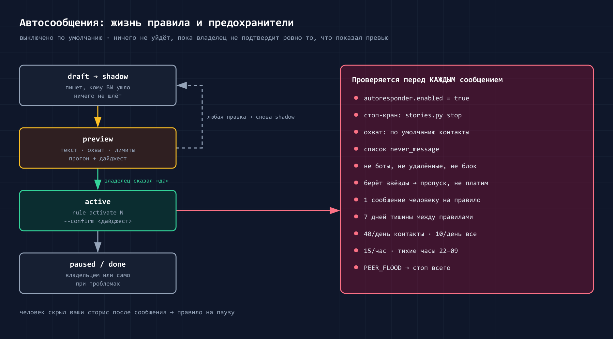
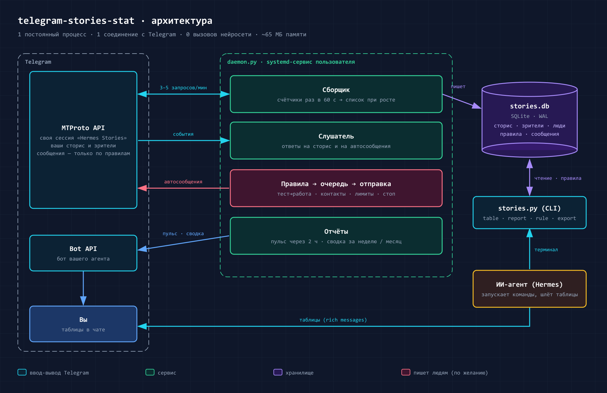
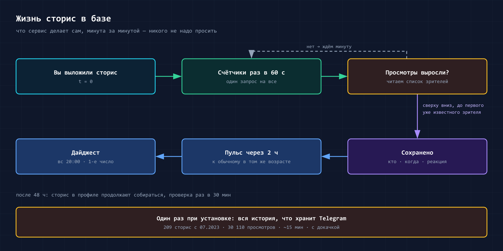

# telegram-stories-stat

[English](README.md) · **Русский** · [История изменений](CHANGELOG.ru.md)


Скилл показывает, кто посмотрел ваши сторис в Telegram и когда. Он делает таблицы статистики и может
отправлять сообщения зрителям по вашим правилам.

Скилл предназначен для персональных ИИ-агентов. Он работает с
[Hermes Agent](https://github.com/NousResearch/hermes-agent) и с любым агентом, который запускает команды в
терминале. Сервис скилла не использует нейросеть: он собирает данные и считает статистику. Агент показывает
вам готовые таблицы.

> **Новое в 1.5.0.** Цифры стали честнее: под каждой таблицей видно, насколько они полные. Сервис дочитывает
> зрителей, которые успели посмотреть сторис в последние минуты. «Пропавшими» не считаются люди, которым
> просто нечего было смотреть. Дашборд можно показать другим без имён зрителей.
> Подробно — в [истории изменений](CHANGELOG.ru.md).

## Функции

### 1. Список зрителей

Сервис сам следит за вашими сторис и записывает каждого зрителя: имя, ник, время просмотра и реакцию. При
установке он загружает историю прошлых сторис, которую ещё хранит Telegram.

Когда сторис исчезает из ленты, сервис ещё раз забирает весь список её зрителей. Так в базу попадают и те, кто
успел посмотреть в последние минуты. Как часто сервис проверяет сторис — в разделе
[Как работает сервис](#как-работает-сервис).

База хранит имя, фамилию, все ники и id каждого зрителя. Если зритель меняет имя или ник, база сохраняет
старые значения. В таблицах ник — это ссылка на профиль. Если у зрителя нет ника, таблица показывает только
имя.

### 2. Статистика одной сторис

Для одной сторис вы получаете:

- просмотры, реакции, ответы и репосты;
- число зрителей через 1, 6, 24 и 48 часов после публикации;
- сравнение с вашими обычными сторис;
- список всех зрителей в порядке просмотра.

Спросите агента: *«Кто посмотрел последнюю сторис?»*

Пример ответа (данные вымышлены):

```
Сторис 221 · 05.10.2026 14:01 · 📷 фото
👁 133 · ❤ 7 · 💬 2 · ↪ 0 · к обычному +12%
1ч: 41 · 6ч: 88 · 24ч: 121 · 48ч: 133 · новых зрителей: 3
👥 101 · 📇 4 · · 28 · ⭐ 6
данные на 07.10 14:05 · в списке 128 из 133 · дочитана после истечения 07.10 14:20
```

| № | Время | Через | Имя | Ник | Реакция | Кто |
|---:|---|---:|---|---|:---:|:---:|
| 1 | 14:03 | +2м | Катя Смирнова | [@kate](https://t.me/kate) | ❤ | ⭐👥 |
| 2 | 14:10 | +9м | Алексей | — | | 📇 |
| 3 | 15:22 | +1ч21м | Макс Ли | [@maxlee](https://t.me/maxlee) | 🔥 | · |

Обозначения: 👁 просмотры, ❤ реакции, 💬 ответы, ↪ репосты. Колонка «Кто»: 👥 взаимный контакт, 📇 контакт,
· не контакт, ⭐ близкий друг. В Telegram ответ приходит настоящей таблицей.

Последняя строка над таблицей говорит, насколько можно доверять цифрам:

- **данные на 07.10 14:05** — когда цифры последний раз сверялись с Telegram;
- **в списке 128 из 133** — Telegram насчитал 133 просмотра, а по именам показал 128 человек. Остальные пятеро —
  это зрители в режиме инкогнито и удалённые аккаунты. Узнать их нельзя никак;
- **дочитана после истечения** — сервис забрал полный список уже после того, как сторис исчезла из ленты. Пока
  сторис висит, здесь написано «сторис ещё активна».

Если спросить про старую сторис, сервис сначала заново прочитает именно её и только потом покажет таблицу.

### 3. Сводка за период

Одна таблица показывает все сторис за период: неделю, месяц или ваши даты. Для каждой сторис таблица
показывает просмотры, реакции и сравнение с обычным результатом. Под таблицей — уникальные зрители, новые
зрители и зрители, которые перестали смотреть.

Как читать эти цифры:

- **Новые зрители** — люди, которых сервис раньше не видел. Сервис помнит не всё: его история начинается с
  самой старой сторис, которую отдал Telegram. Эту дату таблица пишет внизу. Поэтому «новый» зритель мог
  смотреть вас и раньше — просто тех сторис уже нет в истории.
- **Перестали смотреть** — люди, которые смотрели вас в предыдущие 30 дней, а в этом периоде пропали. Это число
  появляется, только если в периоде было хотя бы две сторис. Если вы ничего не публиковали, в таблице «—»:
  перестать смотреть было нечего.

Спросите агента: *«Сводка по сторис за сентябрь»*

### 4. Группы аудитории

Скилл делит зрителей на группы по тому, как они смотрят ваши последние 20 сторис. В таблице видно, сколько
сторис человек посмотрел, например «8/12».

| Группа | Кто туда попадает |
|---|---|
| ядро | смотрит 70 % сторис и больше, обычно в первые 3 часа |
| регулярный | смотрит 40 % сторис и больше |
| эпизодический | смотрит меньше 40 % сторис |
| новый | впервые посмотрел в последние 14 дней |
| остывает | раньше смотрел часто, но уже 3 недели молчит и пропустил минимум 2 ваши сторис |
| пропал | 2 месяца не смотрит и пропустил минимум 3 ваши сторис |

«Остывает» и «пропал» считаются только по сторис, которые человек мог увидеть и не открыл. Если вы месяц ничего
не публиковали, никто не станет «пропавшим»: нельзя перестать смотреть то, чего нет.

Спросите агента: *«Кто моё ядро?»* или *«Кто перестал смотреть мои сторис?»*

### 5. Лучшее время для публикации

Таблица показывает, в какие часы и дни недели люди смотрят ваши сторис. И подсказывает, в какой час
публикации сторис набирают больше зрителей.

Все сторис сравниваются одной меркой — сколько зрителей каждая собрала за первые сутки. Иначе старая сторис,
которую неделями досматривали из профиля, всегда обгоняла бы свежую.

Пример подсказки: «16:00 — 88 (88–93, n=3)». Сторис, выложенные в 16:00, в среднем собирают 88 зрителей за
сутки, от 88 до 93, и посчитано это по трём сторис. Три сторис — мало: это повод попробовать, а не закон.

Очень старые сторис, по которым Telegram отдал неполный список зрителей, в расчёт не идут.

Спросите агента: *«Когда лучше публиковать сторис?»*

### 6. Автоматические отчёты

Сервис сам присылает отчёты в чат с агентом:

- пульс через 2 часа после публикации, например «📈 +30 % к обычному»;
- сводку за неделю, по умолчанию в воскресенье в 20:00;
- сводку за месяц.

### 7. Автоответчик

Автоответчик отправляет зрителю личное сообщение или присылает уведомление вам. Правило задаёт, на какие
сторис реагировать, кому писать и что писать. По умолчанию автоответчик выключен. Подробно — в разделе
[Автоответчик](#автоответчик).

### 8. Сторис каналов

Для ваших каналов скилл показывает просмотры, реакции и репосты каждой сторис. Telegram не показывает
зрителей сторис канала.

Спросите агента: *«Статистика сторис канала @mychannel»*

### 9. Выгрузка в Excel

Скилл сохраняет сторис, зрителей и просмотры в файлы CSV. Excel и Google Таблицы открывают эти файлы.

Спросите агента: *«Выгрузи просмотры за 90 дней в CSV»*

### 10. Дашборд

Скилл собирает один HTML-файл со всей статистикой на одной странице. Откройте его в браузере на компьютере
или на телефоне. Сервер и интернет не нужны.

На странице:

- главные цифры за 30 дней, 90 дней, год или всё время и изменение к прошлому периоду;
- просмотры каждой сторис; цвет сравнивает сторис с вашим обычным результатом;
- лучшие сторис с превью;
- как быстро сторис набирает зрителей;
- лучшее время для публикации и карта просмотров по дням недели и часам;
- динамика по месяцам: зрители, новые зрители, медиана просмотров одной сторис;
- группы аудитории и таблица всех зрителей с поиском;
- сторис канала и правила автоответчика.

Нажмите на сторис — откроется список её зрителей. Нажмите на человека — откроются сторис, которые он видел.
Кнопка **«Перейти к сторис»** открывает сторис в Telegram, пока сторис доступна.


Спросите агента: *«Собери дашборд сторис»*. Агент пришлёт файл.

> **Важно:** в файле имена ваших зрителей. Не пересылайте и не публикуйте его.

### 11. Дашборд без имён — чтобы показать другим

Обычный дашборд пересылать нельзя: в нём ваши зрители. Если хотите показать статистику партнёру, рекламодателю
или команде, попросите агента: *«Сделай обезличенный дашборд»* (команда `stories.py dashboard --anonymized`,
файл `dashboard-anon.html`).

| В копии есть | В копии нет |
|---|---|
| все цифры и графики | имён, ников и id зрителей — ни на странице, ни внутри файла |
| группы аудитории (сколько человек в ядре, сколько новых) | таблицы людей и списков зрителей |
| ваши сторис с подписями и превью | правил автоответчика |

Перед отправкой посмотрите подписи к сторис: если вы в подписи отметили кого-то по нику, этот ник останется —
это ваш собственный текст.

## Установка

Что нужно:

- компьютер или сервер с Linux и Python 3.10 или новее;
- ключи Telegram API `api_id` и `api_hash`. Получите их на <https://my.telegram.org> → API development tools;
- Hermes Agent или другой агент, который запускает команды в терминале.

Порядок установки:

1. Установите скилл:
   ```bash
   hermes skills install itpartypattaya/telegram-stories-stat/skills/telegram-stories
   ```
2. Запустите установщик в терминале:
   ```bash
   python3 ~/.hermes/skills/telegram-stories/scripts/install.py
   ```
3. Введите `api_id` и `api_hash`, когда установщик их запросит. Если ключи `TG_API_ID` и `TG_API_HASH` уже
   есть в `~/.hermes/.env`, установщик их не запрашивает.
4. Отсканируйте QR-код из терминала. На телефоне откройте Telegram → Настройки → Устройства → «Подключить
   устройство».
5. Если у вас есть облачный пароль, введите его. Символы пароля на экране не видны.
6. Нажмите Enter, чтобы загрузить прошлые сторис.

Установщик сам ставит библиотеки Telethon и qrcode, создаёт базу данных и файл настроек и запускает сервис.

Проверьте установку командой `install.py --check`.

Чтобы агент Hermes присылал настоящие таблицы, включите в `config.yaml` настройку
`platforms.telegram.extra.rich_messages: true`. Без неё таблица приходит списком.

Примечание: чтобы войти по номеру телефона и коду, выполните `stories.py login --with-code`.

Другие способы установки:

- **Плагин Hermes.** Выполните `hermes plugins install itpartypattaya/telegram-stories-stat`. Скрипты
  находятся в `~/.hermes/plugins/telegram-stories-stat/skills/telegram-stories/scripts/`.
- **Другой агент.** Скопируйте репозиторий, запустите те же скрипты и дайте агенту файл `SKILL.md`.

Сервис работает из папки, в которой вы запустили `install.py`.

## Автоответчик



### Как устроено правило

Правило состоит из четырёх частей:

| Часть | Варианты |
|---|---|
| **Сторис** | конкретные сторис · следующая сторис · сторис с меткой в подписи (например, `#гайд`) · все сторис |
| **Зрители** | все · конкретные люди (@ник) · сегмент · участники группы · зрители с реакцией · новые зрители · группа аудитории (например, ядро) |
| **Событие** | просмотр · реакция · ответ на сторис |
| **Действие** | личное сообщение зрителю · уведомление вам · добавить зрителя в сегмент |

Правило также задаёт, кому можно писать:

- только вашим контактам (по умолчанию);
- людям, которые уже писали вам;
- всем, включая незнакомых людей.

Правило не нужно писать вручную. Напишите агенту, что нужно. Агент создаст правило и покажет его вам.

### Пример 1. Лид-магнит зрителям последней сторис в серии

**Задача.** Вы публикуете серию сторис. Зрители, которые открыли последнюю сторис, получают ссылку на гайд.

**Порядок действий:**

1. Поставьте метку в подпись только последней сторис, например `#гайд`. В подписях других сторис этой метки
   быть не должно.
2. Напишите агенту: *«Создай правило: всем, кто посмотрит сторис с меткой #гайд, отправь сообщение
   „{first_name}, спасибо за просмотр! Ваш гайд: https://example.com/guide“»*. Вместо `{first_name}` сервис
   подставит имя зрителя.
3. Проверьте превью правила. Если всё верно, ответьте «да».
4. Опубликуйте серию.

**Результат.** Зритель открывает последнюю сторис. Через несколько минут он получает ваше сообщение. Задержка
по умолчанию — от 2 до 6 минут. Каждый зритель получает сообщение один раз.

**Важно:**

- Включите правило до публикации серии. Зрители, которые посмотрели сторис раньше, сообщение не получат.
- Telegram засчитывает просмотр, когда зритель открывает сторис. Быстрое пролистывание серии тоже считается
  просмотром.
- Сообщение — это только текст. Вставьте ссылку на гайд в текст. Файл или кнопку прикрепить нельзя.
- Если закрепить последнюю сторис в профиле, правило работает ещё 30 дней.
- Зритель не из ваших контактов получает сообщение, только если правило разрешает писать всем. Лимит таких
  сообщений — 10 в день на аккаунт.

**Внимание:** Telegram может ограничить аккаунт, если получатели отмечают его сообщения как спам.

**Вариант для большого числа незнакомых зрителей.** В последней сторис напишите: «Ответьте на эту сторис, и
я пришлю гайд». Попросите агента создать правило на ответ, а не на просмотр. Зритель пишет вам первым,
поэтому лимит выше — 40 сообщений в день. Правило срабатывает на любой ответ. Сервис не читает текст ответа.

### Пример 2. Подтверждение, что человек увидел объявление

**Задача.** Вы публикуете сторис для конкретных людей, например для победителей розыгрыша или клиентов с
готовым заказом. Вы хотите знать, когда каждый человек откроет сторис. Человек получает подтверждение в
личном сообщении.

**Порядок действий:**

1. Напишите агенту: *«Когда @anna_k и @maxlee посмотрят мою следующую сторис, пришли мне уведомление.
   Каждому отправь: „Вы увидели объявление. Ваш выигрыш зафиксирован. Я свяжусь с вами сегодня“. Задержка —
   одна минута»*.
2. Агент создаст два правила: уведомление вам и сообщение человеку. Проверьте превью и ответьте «да».
3. Опубликуйте сторис.

**Результат:**

- Вы получаете уведомление: «👀 Анна @anna_k · Сторис 245, 14:03 · правило «Победители»». Время в
  уведомлении — это время просмотра.
- Человек получает ваше сообщение.
- База хранит время просмотра. Спросите агента в любой момент: *«Кто из победителей уже видел объявление?»*

**Важно:**

- Сервис находит просмотр в течение 1 минуты. Новую сторис сервис находит в течение 5 минут. После этого
  начинается задержка правила. С задержкой в одну минуту сообщения приходят через 1–2 минуты после просмотра.
- С 22:00 до 09:00 сообщения и уведомления ждут утра. Эти часы можно изменить в настройках.
- Человек может отсутствовать в базе. Правило сработает при его первом просмотре.
- Уведомление вам работает и при выключенном автоответчике.
- Сервис не отправит сообщение человеку, если вы писали ему за последние 24 часа. Сервис также не отправит
  сообщение, если человек получал автоматическое сообщение за последние 7 дней.
- Если человек не в ваших контактах, правило должно разрешать писать всем.
- Правило отвечает только на свежие просмотры. Если сервис был выключен и нашёл просмотр через сутки, сообщение
  за него никто не получит: «спасибо» через день после просмотра выглядит странно. Просмотры до включения
  правила тоже не считаются.
- Telegram не показывает зрителей в режиме инкогнито. Для них нет ни уведомления, ни сообщения.

### Другие примеры

- **Благодарность за реакцию.** Контакты, которые поставили ❤, получают короткое «спасибо».
- **Новые зрители.** Вы получаете уведомление о каждом новом зрителе. Вы сами решаете, писать ли ему.
- **Прогрев.** Первое правило добавляет зрителей сторис-тизера в сегмент «тёплые». Второе правило после
  основной сторис пишет только этому сегменту.
- **Два варианта текста.** Сервис делит получателей между двумя текстами поровну.
- **Только участники группы.** Создайте сегмент группы: `stories.py segment create vibe --kind chat --source
  @group` (или ссылка на группу, или её числовой ID). Правило пишет только участникам группы. Сервис заново
  читает список участников каждые 15 минут. Прямо перед каждым сообщением сервис спрашивает Telegram, состоит ли
  человек в группе сейчас. Если человек вышел из группы или Telegram не дал ясного ответа, сообщение не уходит.

### Как включить правило

1. Включите автоответчик: укажите `autoresponder.enabled: true` в файле `~/.hermes/telegram-stories.json`.
   Также можно попросить об этом агента. Пока автоответчик выключен, сервис не отправляет личные сообщения.
   Уведомления вам приходят.
2. Опишите агенту нужное правило. Новое правило работает в тестовом режиме: сервис записывает, кто получил бы
   сообщение, и ничего не отправляет.
3. Проверьте превью: текст, получатели, число сообщений и лимиты. Превью считает по уже собранным данным и
   именно по событию правила: для правила «на ответ» — тех, кто уже ответил на сторис, для правила «на
   реакцию» — тех, кто поставил реакцию. В превью видно, сколько людей отсеялось и почему.
4. Ответьте «да». Правило начнёт работать точно в том виде, как в превью. После любого изменения правило
   снова переходит в тестовый режим. Обычно правило отвечает только на новые просмотры. Чтобы написать и тем,
   кто уже посмотрел, так и скажите: *«…и тем, кто уже видел»*.
5. Чтобы увидеть результат, попросите агента: *«Покажи правило 3»*. Вы увидите, кто получил сообщение, кто не
   получил и почему, и кто откликнулся. Отклики делятся на два вида:
   - **ответили на него** — человек нажал «Ответить» именно на ваше сообщение. Это настоящий результат правила;
   - **написали после** — человек просто написал вам в течение недели. Возможно, совсем о другом, поэтому
     считать это результатом правила не стоит.

Чтобы остановить все сообщения, напишите агенту «стоп» или выполните `stories.py stop`. Чтобы продолжить,
выполните `stories.py start`. С телефона: Telegram → Настройки → Устройства → «Hermes Stories» → «Завершить
сеанс».

### Защита аккаунта

Правила не могут отключить эту защиту. Числа можно изменить в настройках.

- По умолчанию сообщения получают только ваши контакты. Писать другим людям нужно разрешить в правиле.
- Сервис не пишет ботам, удалённым аккаунтам и людям, которые скрыли от вас сторис или заблокировали вас.
- Сервис не пишет людям, у которых платные сообщения (за звёзды). Сервис никогда не платит.
- Сервис не пишет людям из списка `never_message`.
- Людям из списка `only_when_named` (например, семье) пишет только правило, где они названы по имени. Правило
  на всех зрителей или на сегмент их не трогает.
- Правило, где человек назван по имени (*«напиши @anna…»*), — ваш собственный выбор: «вы писали ему сегодня» и
  «одно автосообщение в 7 дней» его не останавливают. Лимиты и тихие часы — останавливают.
- Для сегмента группы сервис проверяет участие в группе прямо перед каждым сообщением.
- Один человек получает одно сообщение по каждому правилу. Один человек получает не больше одного
  автоматического сообщения за 7 дней.
- Лимиты в день: 40 сообщений контактам, 40 — людям, которые писали вам, 10 — остальным. Лимит в час —
  15 сообщений.
- Тихие часы: с 22:00 до 09:00. Перед каждым сообщением есть случайная задержка 2–6 минут.
- Если Telegram сообщает о спаме (`PEER_FLOOD`), сервис останавливает все сообщения и уведомляет вас.
- Если человек после автоматического сообщения скрыл ваши сторис или заблокировал вас, сервис останавливает
  правило.

Формат правил и готовые рецепты — в [`references/rules.md`](skills/telegram-stories/references/rules.md).

## Как работает сервис



Скилл состоит из двух частей:

- **Сервис** (`daemon.py`) работает в фоне. Он подключается к Telegram через отдельную сессию и записывает
  данные в базу SQLite на вашем компьютере.
- **Команды** (`stories.py`) читают базу и печатают таблицы. Агент запускает эти команды, когда вы задаёте
  вопрос.

Уведомления и отчёты приходят от бота вашего агента.



Telegram не сообщает о новых просмотрах. Поэтому сервис проверяет сторис сам:

| Как часто | Что проверяет сервис |
|---|---|
| каждую минуту | счётчики просмотров активных сторис |
| когда счётчик вырос | новых зрителей в списке |
| каждые 5 минут | новые сторис |
| каждые 30 минут | сторис, закреплённые в профиле (первые 30 дней) |
| когда сторис исчезла из ленты | весь список зрителей ещё один, последний раз |
| раз в сутки | архив сторис: не вышло ли что-то, пока сервис был выключен |

Так часто сервис проверяет, пока работает хотя бы одно правило автоответчика. **Если правил нет, сервис
проверяет раз в час** — меньше запросов к Telegram. Включили правило — меньше чем через минуту сервис снова
проверяет каждую минуту.

При проверке раз в час ничего не теряется:

- Пульс и сводки перечитывают свои сторис прямо перед отправкой.
- Когда вы просите таблицу или дашборд, сервис сначала обновляет данные, если им больше 5 минут. Причём
  обновляет то, о чём вы спросили: старую сторис, канал или свежие сторис. Если Telegram недоступен, вы увидите
  таблицу и пометку, на какое время данные.
- Ответы на сторис приходят сообщениями, и сервис записывает их сразу.
- Список зрителей исчезнувшей сторис сервис дочитывает в течение 7 дней. Без Premium Telegram хранит его только
  сутки, поэтому сервис успевает за 20 часов.

Чтобы всегда проверять раз в минуту, поставьте в настройках `poll.idle_s: 0`.

Загрузка истории читает архив сторис. Пример: 209 сторис и 30 110 просмотров загрузились примерно за
14 минут.

### Ресурсы

| | |
|---|---|
| Постоянные процессы | **1** (`telegram-stories.service`, сервис systemd пользователя) |
| Память | **~65–70 МБ** (замер: 67,8 МБ; Python 3.11 + Telethon 1.44) |
| Процессор | около 0,5 с на запуск, затем примерно 0,1 % одного ядра |
| Сеть | одно соединение с Telegram, несколько КБ в минуту |
| Диск | ~5 МБ базы на 30 000 просмотров; превью ~20 КБ на сторис (можно отключить) |
| Нейросеть | не используется |
| Кратковременно | команда на ~1 секунду, когда агент запрашивает таблицу; ~10 секунд на дашборд; загрузка истории один раз |
| Не нужно | веб-сервер, открытые порты, сторонние сервисы, телеметрия |

## Отдельная сессия Telegram

Сервис входит в ваш аккаунт как отдельное устройство «Hermes Stories». Причины:

1. Вы можете остановить сервис с телефона: Telegram → Настройки → Устройства → «Hermes Stories» → «Завершить
   сеанс». Другие устройства продолжают работать.
2. Сервис не делит сессию с другими программами. Общая сессия может перестать работать, если две программы
   используют её с разных IP-адресов.
3. Telegram показывает, когда сессия была активна.
4. Ключ сессии можно заменить. Другие сессии при этом не меняются.

**Примечание.** Любая сессия Telegram даёт полный доступ к аккаунту. Сессий «только для чтения» нет. Поэтому:

- ключ сессии хранится только в файле `~/.hermes/.env`, и доступ к файлу есть только у вашего пользователя;
- данные для входа вводите только в терминале. Не пишите пароль в чат с агентом: пароль останется в истории
  чата и попадёт к провайдеру нейросети.

**Примечание.** Ограничения Telegram за спам действуют на весь аккаунт, а не на одну сессию. Аккаунт защищают
лимиты автоответчика.

## Ограничения Telegram

- Telegram не показывает зрителей сторис канала. Доступны только просмотры, реакции и репосты.
- Без Telegram Premium список зрителей удаляется через 24 часа после того, как сторис уходит из ленты. Сервис
  сохраняет список раньше.
- Зрители в режиме инкогнито и удалённые аккаунты не попадают в список. Поэтому «в списке» почти всегда
  чуть меньше, чем просмотров.
- По очень старым сторис (которым год и больше) Telegram может отдать неполный список: например, треть
  зрителей, да ещё с датами через недели после публикации. Такие сторис видны в истории, но в расчёт
  «лучшего времени» и «скорости набора» не идут.

Подробно — в [`references/telegram-limits.md`](skills/telegram-stories/references/telegram-limits.md).

## Где хранятся данные

| Путь | Что хранится |
|---|---|
| `~/.hermes/telegram-stories.json` | настройки (без секретов) |
| `~/.hermes/.env` | ключ сессии `STORIES_SESSION_STRING` и ключи API; доступ только у вашего пользователя |
| `~/.hermes/data/telegram-stories/stories.db` | база: сторис, зрители, время просмотров, реакции, правила, отправленные сообщения |
| `~/.hermes/data/telegram-stories/thumbs/` | маленькие превью сторис (`backfill --no-thumbs` — без превью) |
| `~/.hermes/data/telegram-stories/exports/` | файлы CSV |
| `~/.hermes/data/telegram-stories/dashboard/dashboard.html` | дашборд (`stories.py dashboard` собирает его заново) |
| `~/.hermes/data/telegram-stories/dashboard/dashboard-anon.html` | обезличенная копия (`stories.py dashboard --anonymized`) |

Как посмотреть данные:

- **Спросите агента.** Агент запустит нужную таблицу.
- **Откройте в Excel или Google Таблицах.** Команда `stories.py export views|people|stories [--period 90d]`
  сохраняет файл CSV в папку `exports/`. Для русского Excel укажите в настройках `tables.csv_delimiter: ";"`.
- **Откройте базу.** Используйте программу для SQLite, например DB Browser for SQLite или Datasette. Открывайте
  базу только для чтения. Основные таблицы: `stories` (сторис и прямая ссылка на каждую — `link`), `views` (просмотры), `people` (зрители),
  `people_history` (смены имён и ников), `story_replies` (ответы), `rules` (правила), `deliveries`
  (отправленные сообщения).

Это личные данные ваших зрителей. Они хранятся только на вашем компьютере. Сервис отправляет данные только в
Telegram и в ваш чат с агентом. Тексты ответов на сторис сервис не хранит, он хранит только факт ответа.

Пути можно изменить переменными `HERMES_HOME`, `STORIES_HOME` и `STORIES_CONFIG`.

## Настройки

Установщик создаёт файл `~/.hermes/telegram-stories.json` из
[`examples/config.example.json`](skills/telegram-stories/examples/config.example.json). Основные настройки:

| Настройка | Что задаёт |
|---|---|
| `timezone` | часовой пояс в таблицах |
| `locale` | язык заголовков таблиц: `en` или `ru` |
| `channels` | ваши каналы, сторис которых нужно учитывать |
| `notify` | куда присылать уведомления: `auto` (бот агента), `saved` («Избранное»), `none` (никуда) |
| `digest` | день и время недельной сводки |
| `autoresponder` | включение, лимиты, тихие часы, задержка, списки `never_message` и `only_when_named` |

Сервис применяет изменения раздела `autoresponder` без перезапуска.

## Команды

Агент запускает эти команды сам. Вы также можете запустить их в терминале.

| Команда | Что делает |
|---|---|
| `stories.py table story last` | одна сторис и её зрители (`last`, номер сторис или `-2` — предпоследняя) |
| `stories.py table summary --period 30d` | сводка за период (или `--from … --to …`) |
| `stories.py table people [--status core]` | группы аудитории |
| `stories.py table hours --period 90d` | просмотры по часам и дням недели |
| `stories.py table compare 219 220 221` | сравнение сторис |
| `stories.py table channel --peer @channel` | сторис канала |
| `stories.py export views --period 90d` | выгрузка в CSV |
| `stories.py dashboard [--period 1y]` | HTML-дашборд: один файл; `--no-thumbs` делает его меньше; `--anonymized` убирает все данные зрителей |
| `stories.py rule …` | правила автоответчика |
| `stories.py segment create vibe --kind chat --source @group` | сегмент из участников группы (`segment refresh` перечитывает его сразу) |
| `stories.py stop` / `start` | остановить / продолжить все автоматические сообщения |
| `stories.py doctor` | проверка работы |

## Удаление

1. Выполните `install.py --uninstall`. Команда останавливает и удаляет сервис. Чтобы удалить и собранные
   данные, добавьте `--purge`.
2. Завершите сеанс «Hermes Stories»: Telegram → Настройки → Устройства.
3. Удалите строку `STORIES_SESSION_STRING` из файла `.env`.

## Безопасность

Агент с доступом к терминалу может выполнить те же действия, что и сервис. Защита правил предотвращает ошибки.
Она также не даёт выполнить чужие инструкции из текста, который прочитал агент: правило начинает работать
только после превью, которое видели вы.

От злонамеренного агента эта защита не помогает. В этом случае аккаунт защищают:

- лимиты;
- сообщения только контактам по умолчанию;
- команда `stop`;
- отдельная сессия, которую можно завершить с телефона.

## Раскрытие (Disclosure)

- **Сеть:** Telegram MTProto (сессия сервиса); Telegram Bot API `api.telegram.org` для уведомлений, если задан
  токен бота. Других подключений нет.
- **Файлы:** пути из таблицы выше; systemd-юнит пользователя `~/.config/systemd/user/telegram-stories.service`;
  файл `.env` (один или три ключа).
- **Процессы:** один постоянный сервис; команды по запросу. `install.py` выполняет
  `pip install --upgrade "telethon>=1.40,<2" "qrcode>=7,<9"`, только если этих пакетов нет (`--no-deps` —
  не устанавливать).
- **Возможности:** читает ваши сторис, их зрителей, реакции и ответы. Отправляет личные сообщения только по
  включённым правилам и в пределах лимитов. Не публикует, не вступает в чаты, не платит.
- **Нейросеть:** нет.
- **Автообновления:** нет.

## Тесты

`python -m unittest discover -s tests` — тесты используют вымышленные данные, сеть и Telethon не нужны.

## Лицензия

MIT © Anton Vaskov
